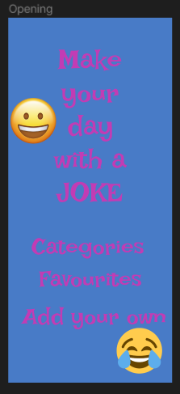

## 1. Jelenlegi helyzet:

Jelenleg nincs olyan mobilalkalmazás, amely lehetővé tenné a felhasználók számára, hogy kategorizált vicceket keressenek,
hozzáadjanak és töröljenek. A vállakozásunk célja hogy az évek során összegyűjtött vicceket egy helyre gyűjtük és
kategórizáljuk őket, valamint az ügyfeleink napját feldobjuk egy frappáns viccel. A viccek kedvelése és saját vicc
hozzáadása is lehetséges. Az alkalmazásunk lehetőleg több operációs rendszerű mobil telefonon, tableten is  működjön,
reszponzív felülettel. Minden funkció hibátlanul működjön és megbízható felületet tudjunk biztosítani.

## 2. Vágyálom rendszer:

A tervezett mobilalkalmazás lehetővé teszi a felhasználók számára, hogy különböző kategóriákban keressenek vicceket,
hozzáadjanak saját vicceket, és töröljék azokat, amelyeket már nem szeretnének megosztani. Szeretnénk felhasználókat
regisztráltatni és ezzel több opciót megnyitni előttük, ebbe tartozna a profil szerkesztése (például: profilkép,
profilnál megjelenő bemutatkozás, megjegyzés,egy személyes kedvencek gyüjtemény amibe a legkedveltebb viccek kerülnek).
A viccek értékelésére is lehetőséget kell adni ami mondjuk egy öt csillagos rendszert képzelnénk el. A viccek
értékelését nem csak csillagok de kommentek formájában is lehetővé tennénk, viszont egy olyan rendszerben ahol bárki
szabadon írhat véleményt elengedhetetlen egy kis csoport akik szabályozni tudják a nagy közönséget tehát  moderátorok
kis csapatát is kell majd foglalkoztatnunk. A viccekhez hozáférést szeretnénk adni azoknak a felhasználóknak akik nem
szeretnének regisztrálni őket egy guest profilba tennénk ahonnan csak a viccek megtekintése lenne elérheő.
A kategorizálás a felhasználók számára  egyszerű rendszerben kell hogy történjen, A háttérben futó adatbázisnak
rugalmasnak kell lennie hiszen a viccek tárháza folyamatosan bővül így ehez alkalmazkodni kell.

## 3. Jelenlegi üzleti folyamatok:

Jelenleg a felhasználóknak manuálisan kell böngészniük a weben vagy más platformokon a viccekért, és nincs egységes hely,
ahol saját vicceiket hozzáadhatnák vagy törölhetnék. A mialkalmazásunk biztosít egy helyet ahol mindig megtalálják a
kedvükre való viccet. Az alkalmazásunk jelenleg tartalmazza a kategória részt amin belül több kategóriára bontva
böngészhetünk a viccek között. Tartalmazza valamint a saját vicceinket amiket mi tudunk hozzáadni. Valamint az általunk
kedvelt vicceket is külön tudjuk kezelni. Az alkalmazás fő profilja viszont a random vicc generálás amit szintén
meg lehet valósítani.

## 4. Igényelt üzleti folyamatok:

Az új rendszerben a felhasználók képesek lesznek keresni a viccek között különböző kategóriákban, hozzáadni saját
vicceiket egy egyszerű felületen keresztül, és törölni azokat, amelyeket már nem szeretnének megosztani.

**Regisztráció:** Az alkalmazás kezdőképernyőjén jelenjen meg a "Regisztráció" gomb,
amelyre kattintva a felhasználó bejuthat a regisztrációs felületre.
A regisztrációs felületen megkérjük a felhasználót, hogy adja meg e-mail címét és jelszavát,
a jelelszó erősségét támodathatjuk javaslatokkal is amik a jelsző mező allat jelenhetne meg.
Az e-mail cím validáció fontos, hogy ne lehessen ugyanazzal az e-mail címmel többször regisztrálni
ezt a standard ellenőrző li kes megoldással csinálhatjuk.
Ha a regisztráció sikeres, akkor a felhasználó bejelentkezhet.
Használhatjuk mondjuk a Firebase Authentication-t a felhasználók regisztrációjának és bejelentkezésének kezelésére Flutterben.

**Profil Szerkesztése:** Bejelentkezés után a felhasználók megtehetik a profiljuk testre szabását a navigációs sávon keresztül.
Profilkép hozzáadására vagy megváltoztatására is lehetőséget nyújtunk a kép feltöltését vagy kiválasztását a galériából  egy image picker library-val oldjhatjuk meg.
Bemutatkozás mezője, valamint egyéb személyes információk szerkesztése is elérhető. Itt is használhatunk Firebaset.

**Kedvencek Gyűjteménye:** A felhasználók kedvencek közé tehetik a legkedveltebb vicceket, amelyeket
később könnyen megtekinthetnek, ehez használhatunk egy adatbázist amiben valhol csináluk egy
kedvencekhez tartozó részt .

**Viccek Hozzáadása:** A regisztrált felhasználók új vicceket is hozzáadhatnak az alkalmazáshoz.
A viccek hozzáadása során meg kell adni a kategóriát és a vicc szövegét egy menüben.
Ezt esetleg egy ürlapos megoldással lehetne megcsinálni modnjuk ennek az ürlapnak a tartalmát
mentjük egy adatbázisba.

**Kommentek Hozzáadása:** A felhasználók hozzászólhatnak a viccekhez, megoszthatják a véleményüket,
vagy akár vicces történeteket is megoszthatnak. Azonban a kommentelést moderáció alá kell helyezni.
Ezt egy komment mezővel lehetne megoldani minden vicc alatt ezt érdemes lehet időnként letörölni hogy,
ne gyüljön fel túl sok, de persze lementési lehetőséget is lehet biztosítani.

**Moderátorok Kiválasztása:** A moderátorok kiválasztásához az alkalmazás üzemeltetője vagy
adminisztrátora elvégezheti a válogatást. A moderátorok olyan felhasználók lehetnek,
akik már hosszabb ideje és aktívan használják az alkalmazást, és megfelelő etikettet mutatnak a kommentekben.
Ezeket a kiválasztottaktat mondjuk egy jelentekezés alkalmával lehet válogatni azokat kell előnyben
részesíteni akik réggebi felhasználók vagy aktívan belefolynak a közösség életébe.
Őket egy oktatás után különböző joggokkal felruházva lehet alkalmazni.

**Moderáció Feladatai:** A moderátorok felelőssége az lesz, hogy ellenőrizzék a felhasználók által beküldött kommenteket,
és eltávolítsák azokat, amelyek megsértik az alkalmazás közösségi szabályzatát vagy etikai irányelveit.

## 5. A rendszerre vonatkozó szabályok:

A rendszernek biztosítania kell a felhasználók személyes adatainak védelmét, és meg kell felelnie az adatvédelmi
szabályoknak. A vicceknek megfelelőnek kell lenniük, és nem tartalmazhatnak sértő vagy megkülönböztető tartalmat.

- Viccek közzététele:
  Regisztrált felhasználók fel tudnak tölteni vicceket a portálra.
  A vicceknek tartalmazniuk kell legalább egy címsort és a vicc szövegét.

- Viccek visszajelzése:
  Felhasználók tudják értékelni a vicceket (pl. tetszik/nem tetszik gombokkal).
  A felhasználók kommenteket fűzhetnek a viccekhez.

- Felhasználói felület:
  Az interfésznek felhasználóbarátnak és könnyen kezelhetőnek kell lennie.

- Hibakezelés:
  A rendszernek kell tudnia kezelni a felhasználói hibákat, és megfelelő hibaüzeneteket kell megjeleníteni.

## 6. Követelménylista:

- Keresési funkció: Az alkalmazásnak lehetőséget kell biztosítania a felhasználóknak arra, hogy különböző kategóriákban
  keressenek vicceket.

- Saját viccek hozzáadása: Az alkalmazásnak lehetőséget kell biztosítania a felhasználóknak arra, hogy hozzáadják saját
  vicceiket.

- Saját viccek törlése: Az alkalmazásnak lehetőséget kell biztosítania a felhasználóknak arra, hogy töröljék saját vicceiket.

- Felhasználóbarát felület: Az alkalmazásnak egyszerűen használhatónak és intuitívnak kell lennie.

- Adatvédelmi szabályok betartása: A rendszernek meg kell felelnie az adatvédelmi szabályoknak.

- Moderációs eszközök: A rendszernek képesnek kell lennie arra, hogy moderálja a tartalmat annak érdekében,
  hogy biztosítsa a közösség számára elfogadható tartalom létrehozását.

## Képernyő terv:

- Kezdőkép:

