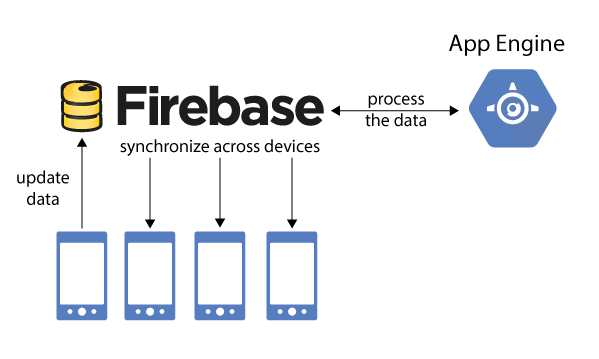

## Rendszer Leírása:

A vicckategorizáló alkalmazás mobil készülékekre fog elsősorban készülni mind IOS és Android platformokra. 
A felhasználók hozzáadhatnak, értékelhetnek, lementhetnek és kategorizálhatnak vicceket. 
A fő profil viszont a random vicc generálás a felhaszáló számára. 
A reszponzivítás mellet korszerű kinézetre törekszünk, ami megnyerő lehet a legtöbb ember számára míg az alkalmazásunk 
fő témáját támasztja alá.

## Rendszer Célja:

Az alkalmazás fő célja, hogy segítse a felhasználókat a viccek könnyebb és szórakoztatóbb kategorizálásban és szervezésében. 
A viccek kategóriába történő rendezése lehetővé teszi a vicces tartalmak könnyebb megtalálását és megosztását, 
valamint megőrzését, miközben a felhasználót is szórakoztatja ajánlásokkal.
Az alkalmazás célja a következők megvalósítása:

•	A felhasználók számára lehetővé tenni viccek gyors és hatékony kategorizálását.
•	Biztosítani a felhasználóknak egy könnyen kezelhető és reszponzív felületet.
•	Vicces tartalmak könnyebb megosztása és terjesztésének elősegítése.
•	Egy folyamatosan bővülő vicc adatbázis létrehozása, ami segíti az ilyen tartalmak megőrzését.

## Terv:

A Vicckategorizáló alkalmazás fejlesztésest következő módon lépésekben tervezzük:
1.	Projektfeladatok lehetőségek meghatározása.
2.	Felhasználói interface dizájn megtervezése.
3.	Viccek kezdő adatbázisának létrehozása.
4.	Viccek hozzáadásának és szerkesztésének funkcióinak kifejlesztése.
5.	Keresési és böngészési funkciók implementálása.
6.	Viccek értékelésének és megjelölésének hozzáadása.
7.	Tesztelés és Hibajavítás
8.	Felhasználói visszajelzések begyűjtése és a felhasználói élmény javítása.
9.	Végleges verzió kiadása.

## Időpontok:

- Első hét a funkciónális specifikáció és követelmény specifikáció megírása.
- Második hét a rendszerterv elkészítése. Az alkalmazás kinézetének megtervezése.
- Harmadik hét a program megírása és tesztelés.

## Erőforrások:

•	Fejlesztők iOS és Android platformokhoz.
•	UI/UX tervezők
•	Adatbázis kezelő
•	Pénzügyi finanszírozás

## Rendszerarchitektúra:

Az alkalmazás Flutterben fog készülni Androidra. 
A Flutter egy nyílt forráskódú UI szoftverfejlesztési eszköztár, amelyet 
a Google fejlesztett ki.
Lehetővé teszi alkalmazások gyors fejlesztését kód alapból.
- Adatmodell:
Az alkalmazás adatmodellje tartalmazza a viccek és a felhasználók adatait. 
A viccekhez tartozik egy cím egy szöveg és 
egy kategória.
A felhasználók beírhatják a keresett vicc címét vagy kulcsszavait.
A képernyő alján található egy 
navigációs sáv, amely lehetővé teszi a felhasználók számára hogy, váltogassanak a különböző nézetek kjözött, mint például
a saját viccek listája vagy a beállítások képernyője.
Backendhez egy MIT license által védett API-t a JokesAPI-t használunk, amit saját felhasználásra ingyenesen lehet használni.

## Felhasználói Interfésze:

Az alkalmazás felhasználói felülete egyszerű és intuitív lesz ahogy azt már fent is taglaltam.
A fő képernyőn található
egy keresőmező, amelybe a felhasználók beírhatják a keresett vicc címét vagy kulcs szavait.
A képernyő alján található
egy navigációs sáv, amely lehetővé teszi a user számára, hogy válogathassanak a különböző nézetek között, mint a például
a saját vicceik listája vagy a beállítások képernyője.
- Tesztelés:
  Az alkalmazás alaposan tesztelni fogjuk, hogy biztosítsuk a hibamentes működést.
  A tesztelés során figyelembe vesszük a
  különböző eszközök és képernyőméretek is.

- Telepítés és karbantartás:
  Az alkalmazást a Google Play Áruházból lesz lehetősége beszerezni a nagyközönségnek.
  Az alkalmazás frissítéseit is ezen
  keresztül fogjuk kiadni.
  A Felhasználói visszajelzések alapján folyamatosan javítani és fejleszteni fogjuk az alkalmazást.

## Projektterv:

A projekt megvalósítása során az agilis fejlesztési módszertant fogjuk követni, ami lehetővé teszi számunkra, hogy gyorsan
reagáljunk a megbízó változtatásaira és a felhasználói visszajelzésekre.
A projekt számos sprintre osztjuk fel, amelyek
mindegyike egy konkrét funkció megvalósítására törekszik.

## Képernyő terv:

- Kezdőkép:

## Karbantartási terv:

1. Rendszerfrissítések
- Cél: Biztosítani, hogy a rendszer mindig a legfrissebb verziót használja a biztonság és teljesítmény optimalizálása érdekében.
- Gyakoriság: Havi rendszerességgel.
- Folyamat:

Ellenőrizni a rendszer alkalmazásait és komponenseit a legújabb verziókért.
Vizsgálni a frissítések kompatibilitását a jelenlegi rendszerrel.
Sikeres tesztek után implementálni a frissítéseket.

2. Adatbázis Karbantartás
- Cél: Biztosítani, hogy az adatbázis optimálisan működjön, és minimalizálni az adatvesztés kockázatát.

- Gyakoriság: Negyedévente.

- Folyamat:

Végrehajtani az adatbázis karbantartási feladatokat, mint például az indexek újraépítése, a táblák optimalizálása, a redundáns adatok eltávolítása stb.
Biztosítani a biztonsági mentéseket az adatbázisról.

3. Hibajavítás
- Cél: Kijavítani a felhasználók által jelzett hibákat és problémákat.
- Gyakoriság: Amint beérkezik egy hibajelentés.

- Folyamat:

Rögzíteni a bejelentett hibákat.
Azonosítani a hibák okait és megoldását.
Implementálni a szükséges javításokat.

4. Felhasználói Visszajelzések Figyelembevétele
- Cél: Figyelembe venni a felhasználói visszajelzéseket és igényeket a rendszer továbbfejlesztése során.

- Gyakoriság: Rendszeres időközönként (pl. negyedévente).

- Folyamat:

Értékelni a felhasználói visszajelzéseket, javaslatokat és panaszokat.
Azonosítani a kiemelkedő igényeket és eldönteni a továbbfejlesztési prioritásokat.

## Firebase API:

A Firebase Autentikációs lehetősége lehetővé teszi felhasználók számára a regisztrálást és bejelentkezést az alkalmazásba.
A felhasználók e-mail címükkel és jelszavukkal vagy szociális média fiókjaikkal regisztrálhatnak és jelentkezhetnek be.
Ezután a Firebase Realtime Database lehetővé teszi az adatok valós idejű szinkronizálását
amiket JSON-struktúrában tárol, és bármilyen változást azonnal frissít az összes felhasználó eszközén.

## Fogalom Szótár:

- Autentikáció: A felhasználók azonosítása és hitelesítése egy rendszerben vagy alkalmazásban, hogy hozzáférjenek bizonyos funkciókhoz vagy tartalmakhoz.

- Firebase: A Google által kifejlesztett platform, amely számos fejlesztői eszközt és szolgáltatást kínál, például autentikációt és valós idejű adatbázist.

- Realtime Database: Egy adatbázisrendszertípus, amely lehetővé teszi az adatok valós idejű szinkronizálását és az azok közötti azonnali frissítéseket.

- Reszponzivitás: Az alkalmazás vagy weboldal képessége arra, hogy alkalmazkodjon különböző képernyőméretekhez és eszközökhöz, hogy a felhasználók számára optimális élményt nyújtson.

- Sprint: Az agilis fejlesztési módszertanban használt időszak, amely során a fejlesztők egy vagy több funkciót vagy feladatot hajtanak végre egy meghatározott idő alatt.

- Karbantartási Terv: Egy tervezett stratégia az alkalmazás vagy rendszer hibáinak és problémáinak javítására, valamint a rendszer frissítéseinek kezelésére.

- UI/UX tervezők: Az alkalmazás felhasználói felületének és felhasználói élményének tervezésére specializálódott szakemberek, akik a felhasználóbarát és vonzó design kialakításában segítenek.

- Adatbázis kezelő: Egy szoftver vagy szakember, aki az adatbázisok létrehozását, karbantartását és kezelését végzi.

- Hibajavítás: A hibák azonosítása és kijavítása egy alkalmazásban vagy rendszerben annak érdekében, hogy a megfelelően működjön.

- Felhasználói Visszajelzés: A felhasználók által adott visszajelzések és észrevételek az alkalmazás vagy rendszer minőségével és funkcionalitásával kapcsolatban.

- Projektterv: Egy dokumentum vagy terv, amely meghatározza egy projekt céljait, feladatokat, határidőket és erőforrásokat.

- JSON: "JavaScript Object Notation" rövidítése, egy könnyen olvasható és írható adatformátum, amely gyakran használatos adatok tárolására és átvitelére az interneten.

Az alkalmazás Flutterben fog készülni Androidra.
A Flutter egy nyílt forráskódú UI szoftverfejlesztési eszköztár, amelyet a Google fejlesztett ki.
Lehetővé teszi alkalmazások gyors fejlesztését kód alapból.

## Adatmodell:

Az alkalmazás adatmodellje tartalmazza a viccek és a felhasználók adatait.
A viccekhez tartozik egy cím egy szöveg és egy kategória.
A felhasználók beírhatják a keresett vicc címét vagy kulcsszavait.
A képernyő alján található egy navigációs sáv, amely lehetővé teszi a felhasználók számára hogy, váltogassanak a különböző nézetek között, mint például a saját viccek listája vagy a beállítások képernyője.

## Csapattagok:

 - Bellér Csaba: fejlesztő
 - Balogh Dávid: fejlesztő
 - Urban Eszter: fejlesztő
